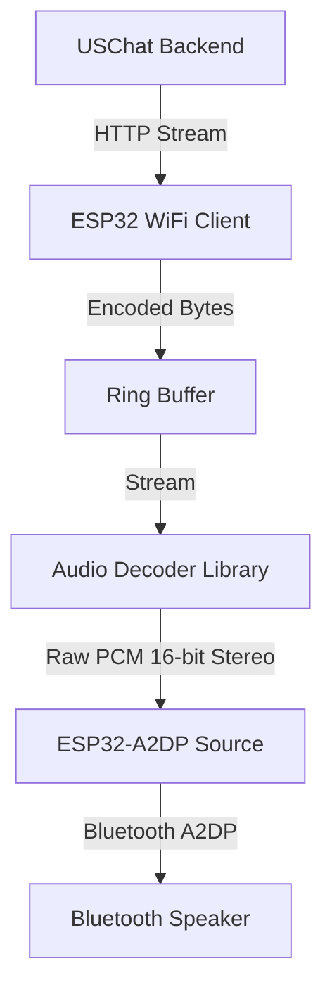

# USChat Music API Integration Guide for ESP32

This guide documents the USChat music API architecture and provides a blueprint for implementing a music streamer on an ESP32 microcontroller that fetches audio streams from the USChat server and plays them over a Bluetooth speaker.

---

## 1. API Architecture Overview

The USChat API is built on Fastify and uses JWT (JSON Web Tokens) for authentication. The base path for all endpoints is `/api/v1`.

### 1.1 Authentication Flow
Before accessing the music API, the ESP32 must authenticate to obtain a session token.

*   **Endpoint:** `POST /api/v1/auth/login`
*   **Headers:**
    *   `Content-Type: application/json`
*   **Request Body:**
    ```json
    {
      "email": "your_email_or_username",
      "password": "your_password",
      "deviceName": "ESP32 Audio Streamer"
    }
    ```
*   **Response Body (Success 200 OK):**
    ```json
    {
      "user": {
        "id": "user-uuid",
        "email": "user@example.com",
        "username": "user123",
        "displayName": "User Name"
      },
      "deviceId": "device-uuid",
      "token": "JWT_ACCESS_TOKEN",
      "refreshToken": "JWT_REFRESH_TOKEN"
    }
    ```
*   **Action for ESP32:** Save the `token` value. For all subsequent music API requests, include this token in the headers:
    `Authorization: Bearer <JWT_ACCESS_TOKEN>`

---

### 1.2 Music Endpoints

All music endpoints require authentication.

#### A. Search Music
*   **Endpoint:** `GET /api/v1/music/search?q=<query_string>`
*   **Headers:**
    *   `Authorization: Bearer <token>`
*   **Response (200 OK):** An array of tracks matching the query.
    ```json
    [
      {
        "title": "Song Title",
        "artist": "Artist Name",
        "duration": 180,
        "trackUri": "https://www.youtube.com/watch?v=videoId",
        "coverUrl": "https://img.youtube.com/vi/videoId/0.jpg"
      }
    ]
    ```

#### B. Liked Songs
*   **Endpoint:** `GET /api/v1/music/liked`
*   **Headers:**
    *   `Authorization: Bearer <token>`
*   **Response (200 OK):** An array of the user's liked songs.
    ```json
    [
      {
        "id": "song-uuid",
        "userId": "user-uuid",
        "title": "Song Title",
        "artist": "Artist Name",
        "album": "Album Name",
        "duration": 180,
        "coverUrl": "https://...",
        "trackUri": "https://www.youtube.com/watch?v=videoId",
        "createdAt": "2026-08-08T12:00:00.000Z"
      }
    ]
    ```

#### C. Get Playlists
*   **Endpoint:** `GET /api/v1/music/playlists`
*   **Headers:**
    *   `Authorization: Bearer <token>`
*   **Response (200 OK):** List of playlists with nested tracks.
    ```json
    [
      {
        "id": "playlist-uuid",
        "name": "My Rock Playlist",
        "coverUrl": null,
        "tracks": [
          {
            "id": "track-uuid",
            "title": "Rock Song",
            "artist": "Rock Band",
            "trackUri": "https://...",
            "position": 0
          }
        ]
      }
    ]
    ```

#### D. Stream Audio
*   **Endpoint:** `GET /api/v1/music/stream?uri=<trackUri>`
*   **Headers:**
    *   `Authorization: Bearer <token>`
*   **Response (200 OK):** Binary stream of audio.
    *   `Content-Type: audio/mpeg`
*   **How it works under the hood:**
    The server resolves the track URI using `yt-dlp` (with the `bestaudio` format parameter) and pipes the standard output directly to the response socket.
    
    > [!IMPORTANT]
    > **Audio Format Notice:** Although the server responds with a header of `Content-Type: audio/mpeg`, the piped output from `yt-dlp`'s `bestaudio` format is typically **AAC (inside an M4A container)** or **Opus (inside a WebM container)**, depending on YouTube's available formats.
    >
    > For the ESP32, which has limited memory and processing power, decoding WebM/Opus streams is extremely difficult. It is highly recommended to transcode the audio on the server or ensure yt-dlp fetches an AAC format that the ESP32 can decode.

---

## 2. Server-Side Optimization for ESP32 (Recommended)

To make it much easier for the ESP32 to decode the stream (using lightweight MP3 or raw AAC decoders), we can modify the server's streaming route to transcode the output directly to **MP3** on the fly using `yt-dlp`'s built-in extraction/transcoding capabilities (which uses `ffmpeg`).

### Proposed Server Change in [music.routes.ts](file:///g:/Uschat/src/routes/music.routes.ts#L170-L178)

Modify the `ytDlpOptions` in `src/routes/music.routes.ts` around line 170 to convert the stream to MP3:

```diff
       const ytDlpOptions: any = {
         output: '-',
-        format: 'bestaudio',
+        format: 'bestaudio',
+        extractAudio: true,
+        audioFormat: 'mp3',
+        audioQuality: '5', // 0 (best) to 9 (worst) - 5 is a good balance for ESP32 streaming
         jsRuntimes: 'node:' + process.execPath,
       };
```

*Note: This requires `ffmpeg` and `ffprobe` to be installed on the server hosting the USChat backend.*

---

## 3. ESP32 Implementation Architecture

To play music from a network stream over a Bluetooth speaker, the ESP32 must act as a **Bluetooth A2DP Source**. It connects to the internet via Wi-Fi, fetches the HTTP audio stream, decodes it in software, and pushes the decoded PCM audio to the Bluetooth A2DP stack.



### 3.1 Hardware Requirements
*   **ESP32 Development Board** (e.g., ESP32-WROOM-32).
    *   *Note: If streaming AAC, using an ESP32 with PSRAM (like ESP32-WROVER) is highly recommended due to the buffer memory needed for AAC decoding. For MP3 streams, standard WROOM chips work fine.*
*   **A compatible Bluetooth Speaker** or Bluetooth headphones.

### 3.2 Key ESP32 Libraries
You will need to install the following libraries in your Arduino IDE / PlatformIO environment:
1.  **[ESP32-A2DP](https://github.com/pschatzmann/ESP32-A2DP)** by Phil Schatzmann: Enables the ESP32 to act as a Bluetooth A2DP Source and transmit raw PCM audio to speakers.
2.  **[arduino-audio-tools](https://github.com/pschatzmann/arduino-audio-tools)** by Phil Schatzmann: A powerful stream-based DSP and plumbing library that makes connecting HTTP streams to decoders and outputs very simple.
3.  **[ArduinoJson](https://arduinojson.org/)** by Benoit Blanchon: For parsing search results and playlist/liked song responses.

---

## 4. ESP32 Code Blueprint (C++)

Here is a complete Arduino/ESP32 C++ sketch that demonstrates how to:
1.  Connect to Wi-Fi.
2.  Log in to the USChat server to get the JWT token.
3.  Fetch the user's **Liked Songs**.
4.  Resolve the first Liked Song and stream its audio.
5.  Decode the audio (MP3/AAC) and transmit it to a paired Bluetooth Speaker.

```cpp
#include <WiFi.h>
#include <HTTPClient.h>
#include <ArduinoJson.h>

// Phil Schatzmann's Audio Tools & A2DP Libraries
#include "AudioTools.h"
#include "AudioCodecs/CodecMP3Helix.h" // Lightweight MP3 decoder for ESP32
#include "AudioLibs/AudioA2DP.h"       // Bridge between audio-tools and ESP32-A2DP

// --- CONFIGURATION ---
const char* ssid = "YOUR_WIFI_SSID";
const char* password = "YOUR_WIFI_PASSWORD";

const char* server_url = "http://YOUR_SERVER_IP:3000"; // USChat base URL
const char* user_email = "your_email@example.com";
const char* user_pass = "your_password";

const char* bt_speaker_name = "My Bluetooth Speaker"; // MUST exactly match the speaker's BT name

// --- GLOBAL VARIABLES ---
String jwt_token = "";
String target_track_uri = "";

// Audio Tools Pipeline Objects
URLStream url_stream;                // Handles HTTP streaming
MP3DecoderHelix mp3_decoder;        // Helix MP3 Decoder
A2DPStream a2dp_stream;             // A2DP Bluetooth Source Output Stream
StreamCopy copier;                  // Copies decoded PCM bytes to Bluetooth

// Callback to feed A2DP
void setup_audio_pipeline(const char* stream_url) {
  Serial.print("Connecting audio stream: ");
  Serial.println(stream_url);

  // Set HTTP headers for authorization
  url_stream.setHttpRequestHeader("Authorization", ("Bearer " + jwt_token).c_str());
  
  // Open the stream
  if (!url_stream.begin(stream_url)) {
    Serial.println("Error: Failed to connect to stream URL");
    return;
  }

  Serial.println("Stream connection opened. Starting decoder...");
}

// Perform login and fetch JWT Token
bool login_to_server() {
  HTTPClient http;
  String loginUrl = String(server_url) + "/api/v1/auth/login";
  
  http.begin(loginUrl);
  http.addHeader("Content-Type", "application/json");

  // Create JSON payload
  StaticJsonDocument<200> doc;
  doc["email"] = user_email;
  doc["password"] = user_pass;
  doc["deviceName"] = "ESP32 Streamer";
  
  String requestBody;
  serializeJson(doc, requestBody);

  int httpCode = http.POST(requestBody);
  if (httpCode == 200) {
    String response = http.getString();
    StaticJsonDocument<1024> resDoc;
    deserializeJson(resDoc, response);
    
    jwt_token = resDoc["token"].as<String>();
    Serial.println("Login successful!");
    Serial.print("JWT Token: ");
    Serial.println(jwt_token.substring(0, 15) + "...");
    http.end();
    return true;
  } else {
    Serial.printf("Login failed. HTTP code: %d\n", httpCode);
    http.end();
    return false;
  }
}

// Fetch user's Liked Songs and extract the first song's trackUri
bool get_first_liked_song() {
  HTTPClient http;
  String likedUrl = String(server_url) + "/api/v1/music/liked";
  
  http.begin(likedUrl);
  http.addHeader("Authorization", "Bearer " + jwt_token);

  int httpCode = http.GET();
  if (httpCode == 200) {
    String response = http.getString();
    
    // Parse the JSON array
    DynamicJsonDocument doc(8192); // Adjust buffer size based on liked song count
    DeserializationError error = deserializeJson(doc, response);
    if (error) {
      Serial.print("JSON deserialization failed: ");
      Serial.println(error.f_str());
      http.end();
      return false;
    }

    JsonArray arr = doc.as<JsonArray>();
    if (arr.size() > 0) {
      JsonObject firstTrack = arr[0].as<JsonObject>();
      String title = firstTrack["title"].as<String>();
      String artist = firstTrack["artist"].as<String>();
      target_track_uri = firstTrack["trackUri"].as<String>();
      
      Serial.printf("Target Track Found: \"%s\" by %s\n", title.c_str(), artist.c_str());
      Serial.printf("URI: %s\n", target_track_uri.c_str());
      http.end();
      return true;
    } else {
      Serial.println("No liked songs found on this account.");
    }
  } else {
    Serial.printf("Failed to fetch liked songs. HTTP code: %d\n", httpCode);
  }
  
  http.end();
  return false;
}

void setup() {
  Serial.begin(115200);
  delay(1000);

  // 1. Connect to WiFi
  WiFi.begin(ssid, password);
  Serial.print("Connecting to WiFi");
  while (WiFi.status() != WL_CONNECTED) {
    delay(500);
    Serial.print(".");
  }
  Serial.println("\nWiFi connected.");

  // 2. Login to get JWT Token
  if (!login_to_server()) {
    Serial.println("Critical error: Unable to log in. Halting.");
    while (true) delay(1000);
  }

  // 3. Retrieve a song to play
  if (!get_first_liked_song()) {
    Serial.println("No song found to play. Halting.");
    while (true) delay(1000);
  }

  // 4. Initialize Bluetooth Speaker Connection (A2DP Source)
  Serial.print("Initializing Bluetooth Transmitter. Pairing with: ");
  Serial.println(bt_speaker_name);
  
  // Set up A2DP configuration
  auto cfg = a2dp_stream.defaultConfig(TX_MODE);
  cfg.name = bt_speaker_name;
  a2dp_stream.begin(cfg);
  
  // Wait a few seconds for Bluetooth to connect to the speaker
  Serial.println("Waiting for Bluetooth speaker to pair and connect...");
  delay(5000);

  // 5. Connect and setup the audio decoder pipeline
  // Stream URL: /api/v1/music/stream?uri=<encodedUri>
  String encodedUri = target_track_uri;
  // Simple URL encoding helper for ESP32
  encodedUri.replace(":", "%3A");
  encodedUri.replace("/", "%2F");
  encodedUri.replace("?", "%3F");
  encodedUri.replace("=", "%3D");
  encodedUri.replace("&", "%26");

  String streamUrl = String(server_url) + "/api/v1/music/stream?uri=" + encodedUri;
  setup_audio_pipeline(streamUrl.c_str());

  // 6. Connect decoder to the Bluetooth speaker stream
  mp3_decoder.begin();
  copier.begin(a2dp_stream, url_stream); // Link URL stream source directly to A2DP output via copier
  Serial.println("Audio playback initiated.");
}

void loop() {
  // Read from the URL stream, decode on the fly, and write to Bluetooth
  // StreamCopy handles checking if bytes are available and feeding the decoder/A2DP
  copier.copy(mp3_decoder);
}
```

---

## 5. Key Implementation Gotchas & Troubleshooting

### 1. **Bluetooth Classic + WiFi Coexistence (Crucial)**
ESP32 has a single 2.4 GHz radio shared between WiFi and Bluetooth. Playing A2DP Bluetooth audio while simultaneously downloading an audio stream over WiFi can cause packet drops (clicks, stutters, or complete disconnection).
*   **Fix:** In your ESP32 configuration menu (via ESP-IDF or PlatformIO `sdkconfig`), enable **Software DM (Dynamic Memory) allocation** and **WiFi/Bluetooth Coexistence** options.
*   **Alternative:** Use a 5GHz-capable ESP32 variant (like ESP32-C6) or increase the `URLStream` buffer size in `arduino-audio-tools` to buffer 5-10 seconds of raw audio so the WiFi radio can rest while Bluetooth streams.

### 2. **Buffer Underruns**
The A2DP stream requires a constant supply of PCM samples. If the network stream slows down, or decoding falls behind, the audio will stutter.
*   **Fix:** Implement a buffer ring in `arduino-audio-tools` between `URLStream` and the decoder. Wait until the buffer is 30% full before calling `copier.copy()`.

### 3. **Decoders (AAC vs MP3)**
If you do **not** transcode to MP3 on your server, YouTube streams are typically AAC.
*   **Helix AAC Decoder:** To decode AAC on ESP32, replace `#include "AudioCodecs/CodecMP3Helix.h"` with `#include "AudioCodecs/CodecAACHelix.h"` and use `AACDecoderHelix` instead of `MP3DecoderHelix`. 
*   Note that Helix AAC requires significant RAM, making an ESP32 chip with **PSRAM** (e.g. ESP32-S3-WROOM-2 or ESP32-WROVER) mandatory for reliable playback.
