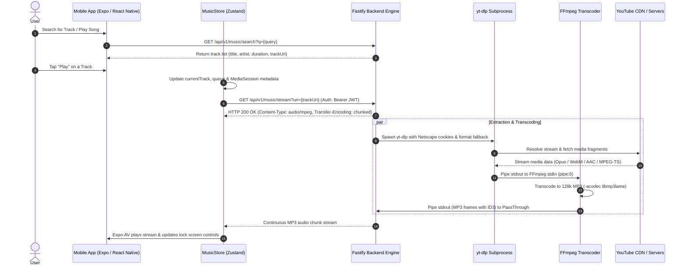

# USChat Music Streaming Architecture & Roadmap

This document provides a detailed breakdown of how music search, stream extraction, transcoding, and playback currently operate across the USChat ecosystem, along with operational bottlenecks and future engineering milestones.

---

## 1. High-Level Architecture Diagram



---

## 2. End-to-End Component Breakdown

### A. Track Search & Discovery (`/api/v1/music/search`)
1. **Lavalink Primary Search**:
   - The backend queries a configured Lavalink node (`/v4/loadtracks?identifier=ytsearch:...`).
   - If tracks are found, they are formatted into normalized track objects (`title`, `artist`, `duration`, `trackUri`, `coverUrl`).
2. **Direct YouTube Scraper Fallback**:
   - If Lavalink is unreachable, unauthenticated, or returns no results, the server falls back to `searchYouTube(query)`.
   - Fetches the HTML search result page with a modern desktop User-Agent, parses `ytInitialData`, and extracts video renderer metadata.

### B. Request Ingestion & Cookie Translation (`/api/v1/music/stream`)
1. **Authentication**: All stream requests require a valid user JWT (`Bearer <token>`).
2. **Dynamic Cookie Conversion**:
   - Modern browser cookie exporters output JSON arrays (`youtube_cookies.json`).
   - `yt-dlp` requires standard **Netscape HTTP Cookie File** format.
   - On every stream request, `convertJsonToNetscape()` checks `youtube_cookies.json` and updates `youtube_cookies.txt` with tab-delimited Netscape formatting (`domain`, `flag1`, `path`, `flag2`, `expiration`, `name`, `value`).

### C. Audio Extraction Pipeline (`yt-dlp-exec`)
1. **Format Fallback Selection**:
   - Format selector: `'bestaudio/ba/b[height<=360]/b[ext=mp4]/best'`.
   - *Why this is necessary*: Modern YouTube often restricts pure audio-only streams (`vcodec=none`) for authenticated cookies, only serving combined audio/video containers (like format 18 or m3u8 HLS streams 91–96). The fallback ensures extraction never crashes with `"Requested format is not available"`.
2. **JavaScript Challenge Solving**:
   - Passes `jsRuntimes: 'node:' + process.execPath`.
   - Uses Node.js to evaluate YouTube's dynamic player signature and `n` challenges.
3. **Execution**:
   - Runs `yt-dlp` with `output: '-'` (streaming directly to `stdout`).

### D. Real-Time Transcoding (`FFmpeg`)
1. **The Issue Without Transcoding**:
   - `yt-dlp` outputs varying containers depending on YouTube's response (WebM with Opus, MP4 with AAC, or MPEG-TS fragments with `0x47` sync bytes).
   - Mobile media engines (Android MediaPlayer / ExoPlayer via `expo-av`) fail to decode streams when the MIME header (`audio/mpeg`) does not match the raw container payload.
2. **The Transcode Solution**:
   - If `ffmpeg` is available on the host system, `yt-dlp` stdout is piped into FFmpeg:
     ```bash
     ffmpeg -loglevel error -i pipe:0 -vn -acodec libmp3lame -b:a 128k -f mp3 pipe:1
     ```
   - `-vn`: Strips any video tracks completely (saving bandwidth and CPU).
   - `-acodec libmp3lame -b:a 128k -f mp3`: Encodes audio into standard MP3 chunks with ID3 headers.
   - The output stream is 100% compliant `audio/mpeg` playable across all devices and browsers.

### E. Fastify Streaming & Connection Management
1. **Immediate Header Commitment**:
   - Fastify sets:
     - `Content-Type: audio/mpeg`
     - `Cache-Control: no-cache`
     - `Connection: keep-alive`
   - Returns a Node.js `PassThrough` stream immediately. This prevents reverse proxies (Nginx / Cloudflare) and mobile clients from timing out during YouTube's internal 4–5s site-required cooldown sleep.
2. **Process Lifecycle & Cleanup**:
   - `request.raw.on('close')`: When the mobile app pauses, changes track, or disconnects, the handler terminates both `ytSubprocess` and `ffmpegProcess` using `process.kill()` to prevent orphaned background processes.

### F. Mobile App Playback (`frontend/src/store/musicStore.ts`)
1. **Audio Player**:
   - Uses `expo-av` (`Audio.Sound.createAsync`).
   - Configured with `staysActiveInBackground: true` and `playsInSilentModeIOS: true`.
2. **Android Native MediaSession**:
   - Integrates with `USChatMediaSessionModule` (Kotlin native module).
   - Updates lock screen notification, track artwork, artist name, and duration.
   - Listens for hardware / Bluetooth media button events (`play`, `pause`, `next`, `previous`, `seekTo`).
3. **Infinite Loop Protection**:
   - `onPlaybackStatusUpdate` checks `positionMillis > 1000` before triggering `nextTrack()` on `didJustFinish`. If a track terminates prematurely (<1s), playback halts cleanly rather than hammering the backend in an endless loop.

---

## 3. Current Limitations & Technical Debt

| Limitation | Impact | Root Cause |
| :--- | :--- | :--- |
| **YouTube Anti-Bot Throttling** | 4–5 second delay before first audio byte arrives. | YouTube requires a cooldown period (`Sleeping X seconds as required by the site`). |
| **Cookie Staleness** | Playback breaks when cookies expire (HTTP 403 / bot detection). | Google accounts require periodic cookie updates. |
| **No Server-Side Caching** | The same song played 100 times downloads and transcodes from YouTube 100 times. | Stream is piped in real-time directly to stdout without disk or object storage caching. |
| **CPU Spikes on Concurrent Streams** | High simultaneous playback taxes the server CPU. | Each active listener spawns a separate `yt-dlp` and `ffmpeg` transcode process. |

---

## 4. Engineering Roadmap

### Phase 1: Server-Side Song Caching (High Priority)
- [ ] **Disk / Object Storage Cache**:
  - Hash track URL/ID (e.g., `md5(trackUri)`).
  - Check if `/cache/audio/{hash}.mp3` exists.
  - If cached: serve the static MP3 file immediately using HTTP Range requests (instant playback, 0s delay, 0 CPU transcode).
  - If not cached: stream via `yt-dlp + ffmpeg` while simultaneously writing to `/cache/audio/{hash}.mp3` for future requests.
- [ ] **Cache Eviction Policy**:
  - Implement LRU (Least Recently Used) cache to cap local disk usage (e.g., max 20GB).

### Phase 2: Client-Side Buffering & Pre-fetching (Medium Priority)
- [ ] **Next Track Pre-fetching**:
  - When the current track reaches 85% completion, trigger the backend to resolve and warm the cache for `queue[queueIndex + 1]`.
  - Enables instant, gapless track transitions on mobile.
- [ ] **Local Mobile Cache**:
  - Cache downloaded chunks in the mobile app's temporary file storage so replay does not consume network bandwidth.

### Phase 3: Cookie Resilience & Extraction Fallbacks (High Priority)
- [ ] **Multi-Source Fallback**:
  - Integrate Piped / Invidious API instances as secondary audio sources if YouTube rejects the current cookie session.
- [ ] **Automated Headless Cookie Refresh**:
  - Implement a lightweight automated script or OAuth device flow to refresh cookies without manual extraction.

### Phase 4: Migration to Modern Android Media3 (Future Enhancement)
- [ ] Replace `expo-av` with a dedicated Android **Media3 / ExoPlayer** native module.
- [ ] Support native HLS / DASH adaptive streaming and system-level media notification controls with seekbar scrubbing.
